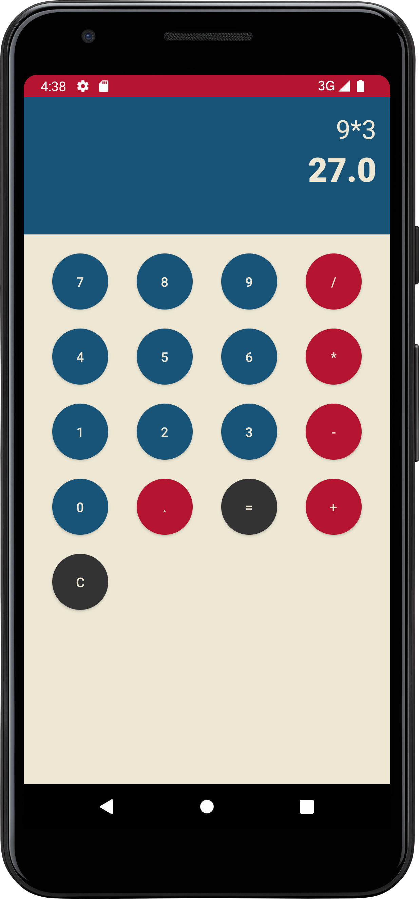

# U12 | Ein Taschenrechner

## Aufgabe

Das Ziel dieser Aufgabe ist die Implementierung einer simplen Taschenrechner-App. Dabei ist nur die CalculatorHelper-Klasse vorgegeben, mit der man einen mathematischen Term (`String`) berechnen kann. UI, Eingabe und Ausgabe kann dabei komplett frei gestaltet werden

## Hinweise

* Ihr könnt euch an den Screenshots unten orientieren, müsst euch aber nicht daran halten. Das Design ist von euch frei wählbar. Schaut euch in diesem Zusammenhang auch noch einmal das [`GridLayout`](https://developer.android.com/reference/android/widget/GridLayout) an, das man hier verwenden kann (aber nicht muss).
* Versucht zu vermeiden, jeden Button über einen einzelnen _Listener_ anzusteuern (Ein und der selbe _Listener_ kann z.B. auch auf mehreren _Buttons_ registriert werden).
* Für die eigentliche Berechnung wird die [exp4j-Library](https://www.objecthunter.net/exp4j/index.html) verwendet, die bereits implementiert ist und in der `CalculatorHelper`-Klasse verwendet wird
* Die `CalculatorHelper`-Klasse besitzt eine statische öffentliche Methode `calculate(String expression)`. Diese berechnet das Ergebnis eines mathematischen Terms und gibt es als String zurück. Dabei können als Operatoren folgende Zeichen verwendet werden: **Addition** (`+`), **Subtraktion** (`-`), **Multiplikation** (`*` oder `x`), **Division** (`/` oder `÷`)

## Tipps zum Vorgehen

- Entwerft ein _User Interface_ das über die notwendigen Elemente für die Interaktion mit dem Taschenrechner verfügt. Dabei sind vor allem die _Buttons_ für die Zahlen und Operatoren und ein Bereich zur Anzeige des Terms bzw. Ausgabe des Ergebnis wichtig.
- Erlaubt den NutzerInnen durch Interaktion mit den _Buttons_ einen Term einzugeben. Der Term kann dabei erstmal ein einfacher _String_ sein, in dem Zahlen und Operatoren in der Reihenfolge erscheinen, in der sie eingegeben wurden. Der aktuelle Term sollte stets sichtbar sein.
- Berechnet, nach dem die NutzerInnen auf den `=`-Button geklickt haben, das Ergebnis und zeigt dies im UI an. Nutzt dafür die vorgegebene `CalculatorHelper`-Klasse.

## Screenshots

|  Start   |   Eingabe    |   Ergebnisse    |
|:------:|:-------:|:-------:|
|   |   |  |
